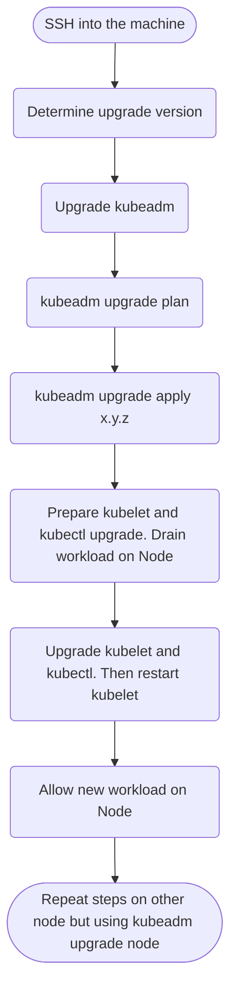

## Objective
Upgrade the `controlplane` Node to a newer patch version.

Also upgrade `kubectl` and `kubelet` .

## Clue
### Workflow


### How-to
```bash
# determine current version
k get no
k version
kubeadm version -o yaml

# determine available kubeadm versions
apt-cache madison kubeadm

# (optional) unhold is used to cancel a previously set hold on a package to allow all actions again.
# apt-mark unhold kubeadm

# install newer kubeadm version
apt install kubeadm=1.33.5-1.1

# (optional) hold is used to mark a package as held back, which will prevent the package from being automatically installed,  upgraded or removed.
# apt-mark hold kubeadm

# check which versions are available to upgrade to and validate whether your current cluster is upgradeable.
kubeadm upgrade plan

# upgrade your Kubernetes cluster to the specified version
kubeadm upgrade apply v1.33.5

# drain the control-plane
kubectl drain [node] --ignore-daemonsets

# determine available kubelet version
apt-cache madison kubelet

# optional
# apt-mark unhold kubelet

apt install kubelet=1.33.5-1.1 kubectl=1.33.5-1.1

# optional
# apt-mark hold kubelet

# restart kubelet
systemctl daemon-reload && systemctl restart kubelet

# uncordon the node
kubectl uncordon [node]
```