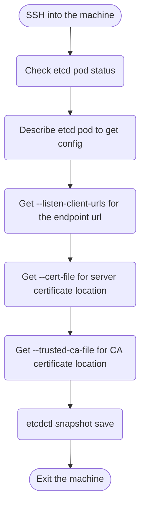

## Objective


## Clue
### Workflow


### How-to
```bash
# get the etcd details
kubectl get pods -n kube-system
kubectl describe pod etcd-xxx -n kube-system
ETCDCTL_API=3 etcdctl --cacert=xxxx \
    --cert=xxx \
    --key=xxx \
    snapshot save /opt/etcd-backup.db
```

## References
- [Backing up an etcd cluster](https://kubernetes.io/docs/tasks/administer-cluster/configure-upgrade-etcd/#built-in-snapshot)